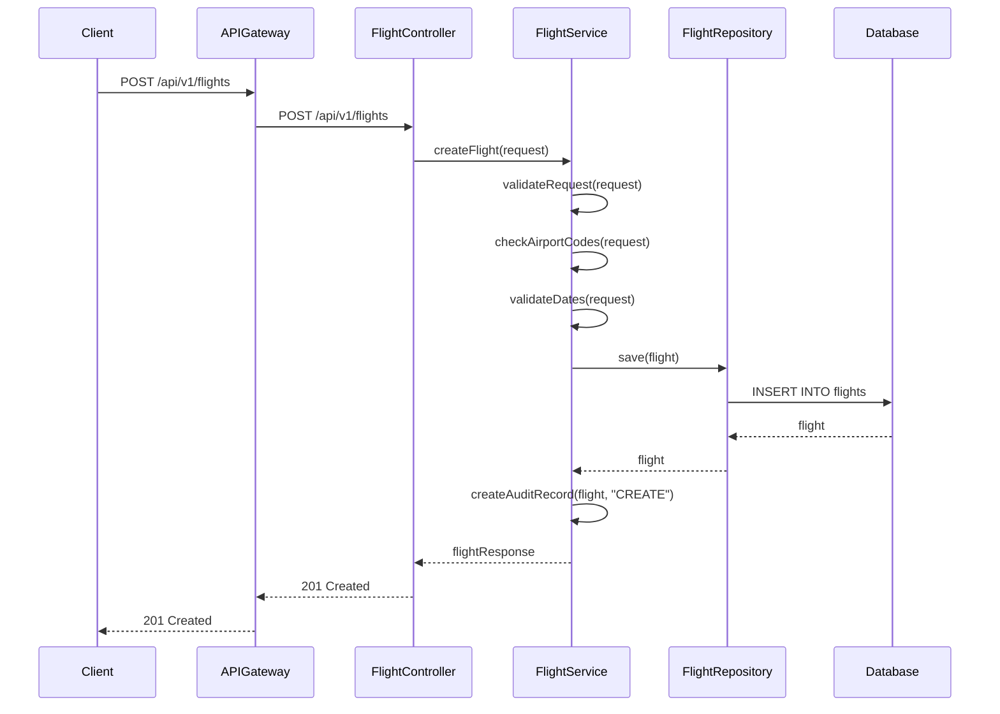
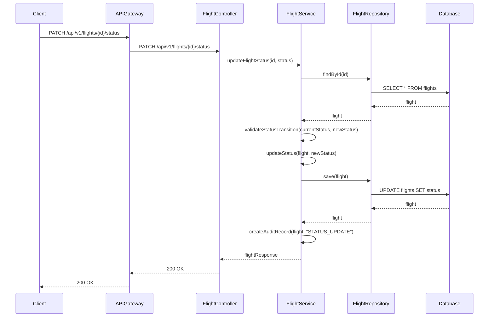
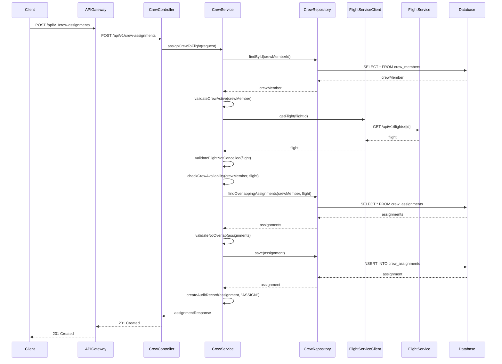
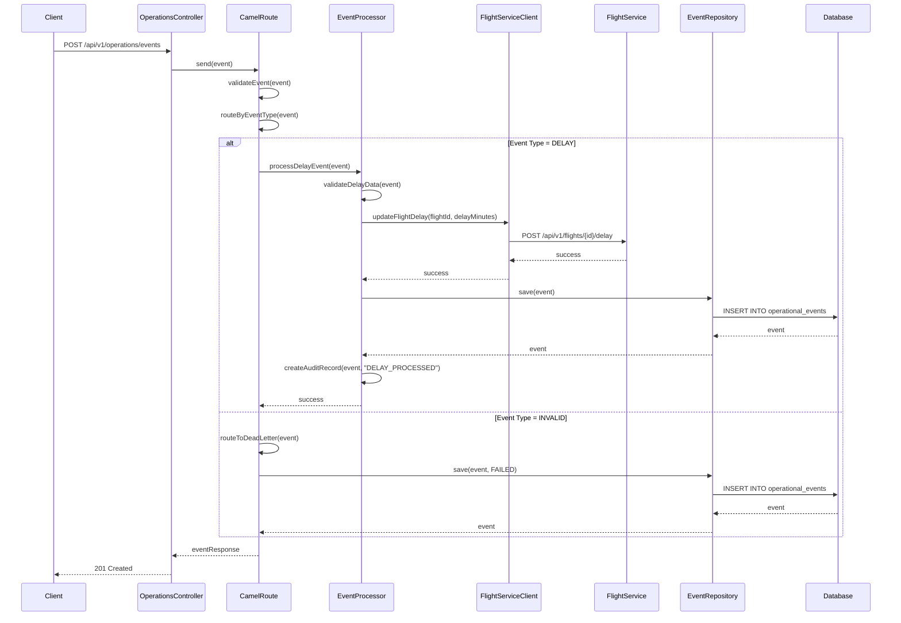
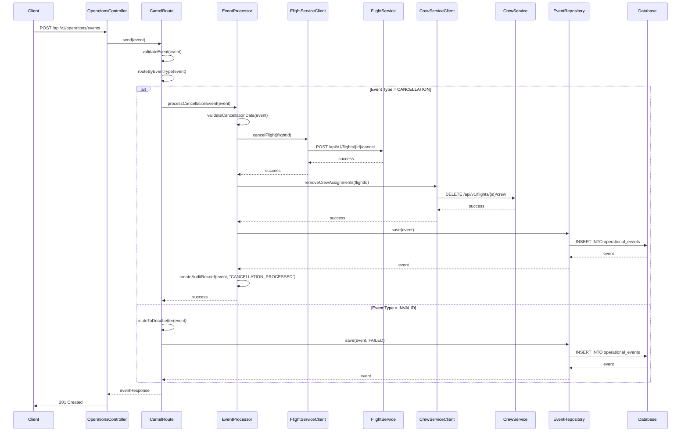
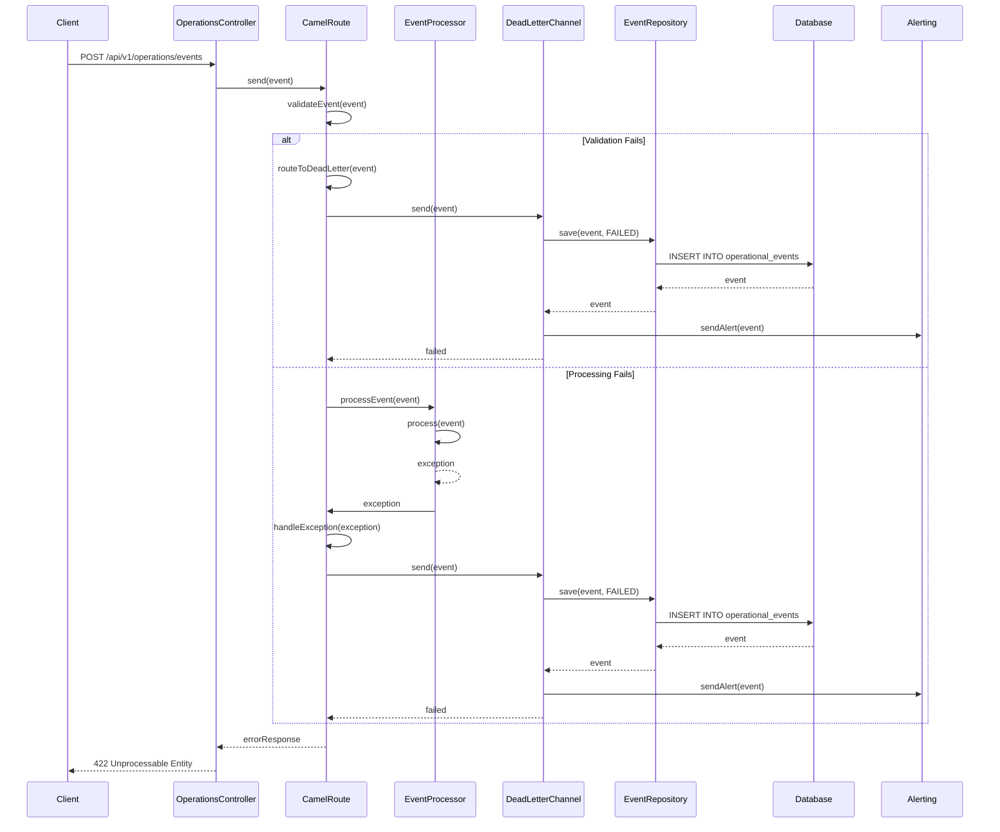
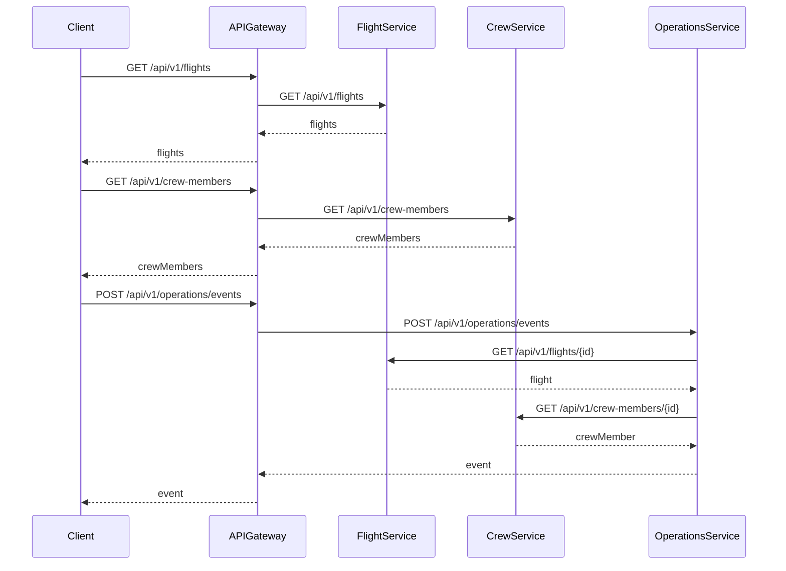
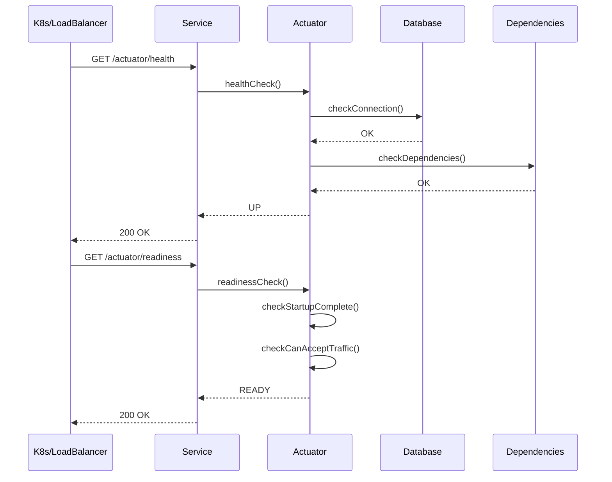

# Sequence Diagrams

## Create Flight

## Update Flight Status

## Assign Crew to Flight

## Process Delay Event

## Process Cancellation Event

## Handle Failed Operational Event

## Service Communication via API Gateway

## Health Check Flow

